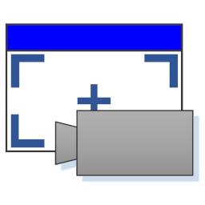
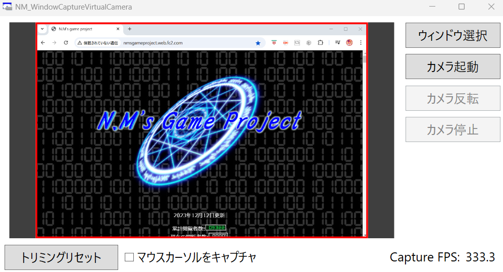
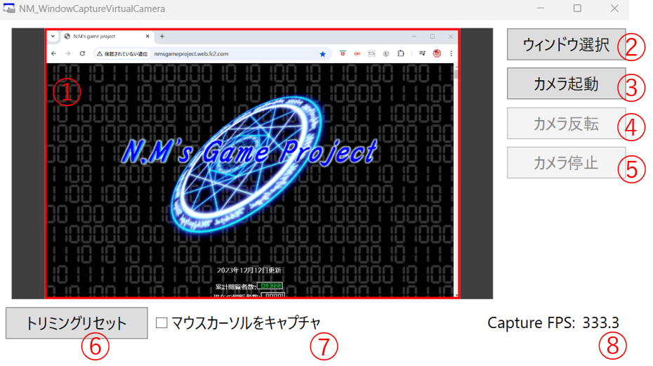

#  NM_WindowCaptureVirtualCamera

[English](README.md)

ウィンドウをキャプチャし、仮想カメラ（MediaFoundation, DirectShow）で映像を送る汎用ツールです。
映像はDiscordやTeamsのカメラ映像として表示できます。

[OBS](https://obsproject.com)の仮想カメラと比較し、以下のような特徴があります。

* ウィンドウのキャプチャと仮想カメラへの映像送信に機能を絞ることで、サイズの小さい（約1.5MB）ツールとなっています。

* 簡単な設定でウィンドウの選択や仮想カメラの起動、映像のトリミングを行うことができます。

* Windows 11から使用可能なMediaFoundationの仮想カメラを使用できます。Windows標準のカメラアプリにも映し出すことができます。

# 必要環境

* OS: Windows 10, Windows 11 (MediaFoundation仮想カメラはWindows 11のみ使用可能)

* DirectX 11がサポートされている必要があります。

# 依存関係

nuget経由で[WPFDXInterop](https://github.com/microsoft/WPFDXInterop)を導入しています。

また、WPFのプロジェクト (NM_WindowCaptureVirtualCamera) では.NET Core 9.0を使用しております。

# インストール方法

## インストーラを使用する場合（x64用）

1. [こちら](https://github.com/HexagramNM/NM_WindowCaptureVirtualCamera/releases/download/v1.0.0/NM_WindowCaptureVirtualCamera.zip)からインストーラを含むzipファイルをダウンロードし、解凍してください。

2. 解凍したフォルダの中にある`setup.exe`を実行します。

3. インストーラが起動するので、インストーラの指示に従って、インストールを進めます。このタイミングで仮想カメラの設定も行われます。

4. 完了するとデスクトップにショートカットが生成されます。ショートカットをダブルクリックすると、ツールが起動します。

5. アンインストールするときは、Windowsの設定にある「プログラムの追加と削除」を開いてください。
   NM_WindowCaptureVirtualCameraがあるので、そのアンインストールボタンを押してください。

## Visual Studioでビルドする場合

ビルドにはVisual Studio 2022を使用しております。

1. このリポジトリをクローンします。

2. クローン後、`setupRepository.bat`を実行してください。

    これにより、以下の処理を実行します。
    - `bin`ディレクトリの生成
    
    - サブモジュール内の不要なファイルを削除するように設定

    - DirectShowの古いVisual Studio用プロジェクトをアップグレード

    - DirectShowのビルド（必要なスタティックライブラリのビルド）

3. Visual Studioで`NM_WindowCaptureVirtualCamera.sln`を開き、Releaseモードでビルドします。
   ツールのexeファイルなどはルートにできた`bin`ディレクトリに生成されます。

4. ビルドが完了したら、管理者権限で`installVCam.bat`を実行してください。
   これにより仮想カメラがレジストリに登録されます。

5. `bin`ディレクトリにあるexeファイルをダブルクリックすると、ツールが起動します。

6. アンインストールする際はファイルを消す前に、管理者権限で`uninstallVCam.bat`を実行してください。
   これによりレジストリにある仮想カメラの登録が解除されます。

# 使用方法

## 基本的な流れ

以下のような順序で設定します。

1. ②のボタンを押し、キャプチャするウィンドウを選択します。

    ウィンドウを選択するための画面が開きます。ウィンドウを選び、OKボタンを押してください。

2. ③のボタンを押し、仮想カメラを起動します。

3. 必要に応じて、トリミングなどの設定を行います。（①, ④, ⑥, ⑦）

4. DiscordやTeamsのカメラ設定で以下のどちらかを選択することで、キャプチャされたウィンドウの映像がカメラの映像として表示されます。

    * **NM_WCVCam_MF**: Windows 11の場合のみ使用可能な、新しいAPI (MediaFoundation) を使用した仮想カメラです。

    * **NM_WCVCam_DS**: 古いAPI (DirectShow) を使用した仮想カメラです。

5. カメラを停止する場合は、⑤のボタンを押すか、×ボタンでツールを閉じてください。

## 機能詳細

* **①: ウィンドウのプレビュー、トリミング設定**

    現在キャプチャされているウィンドウが表示されます。周りにある赤い四角の中にある範囲が仮想カメラ上に表示され、
    外側はトリミングされます。

    赤い四角の辺をクリックし、ドラッグすると、その辺を動かし、トリミング範囲を変更できます。
    赤い四角の中をクリックし、ドラッグすると、四角全体を移動することができます。

* **②: ウィンドウ選択**

    キャプチャするウィンドウを選択するための画面を開きます。
    
    デフォルトでは「ウィンドウを共有」となっております。ウィンドウを選択し、OKボタンを押すことで、
    そのウィンドウのキャプチャが始まります。

    「ウィンドウを共有」のところをクリックし、「ディスプレイを共有」に変更することで、
    画面全体をキャプチャするよう設定することもできます。

    ウィンドウ選択後も、再度このボタンを押すことで、別ウィンドウをキャプチャするよう切り替えることができます。

* **③: カメラ起動**

    押すことで仮想カメラが起動し、キャプチャされたウィンドウの映像が送信されます。

* **④: カメラ反転**

    押すことで仮想カメラに表示される映像を左右に反転します。

* **⑤: カメラ停止**

    押すことで仮想カメラを停止し、映像の送信も停止します。

* **⑥: トリミングリセット**

    ①のトリミング設定をリセットし、ウィンドウ全体を仮想カメラに表示します。

* **⑦: マウスカーソルをキャプチャ**

    チェックをつけると、マウスカーソルも表示された状態で、仮想カメラに映像が送信されます。

* **⑧: ウィンドウキャプチャのFPS**

    ウィンドウがキャプチャされる1秒間あたりの回数が表示されます。

# 免責事項

致命的なバグ等無いように注意しておりますが、本ツールをインストール、使用したことにより問題が発生した場合も、
こちらでは責任を負いかねます。あらかじめご了承ください。
