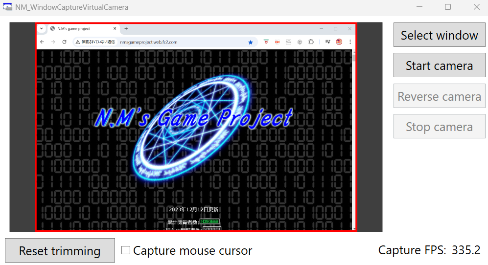
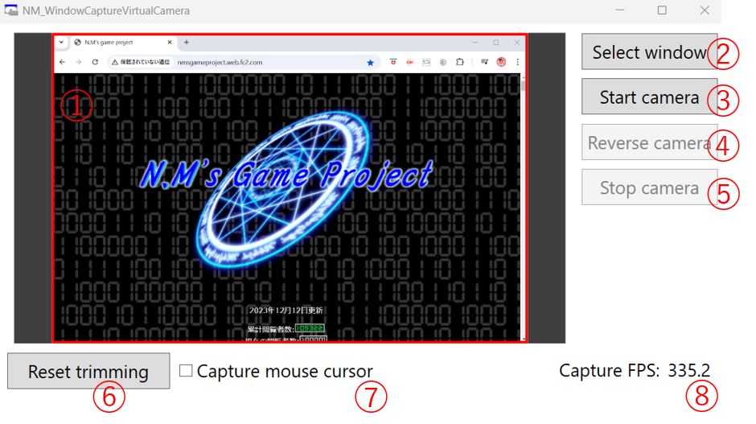

#  NM_WindowCaptureVirtualCamera

[日本語](README.md)

[!NOTE]
GitHub Copilot Free is used for translation of this document.

This is a general-purpose tool that captures a window and sends its footage to a virtual camera (MediaFoundation, DirectShow).
The footage can be displayed as camera footage in Discord or Teams.

Compared to the virtual camera of [OBS](https://obsproject.com), it has the following features:

* By focusing on capturing a window and sending its footage to the virtual camera, it gets a small tool. (Its size is about 1.5MB.)

* You can easily select windows, start the virtual camera, and trim the video with simple settings.

* You can use the MediaFoundation virtual camera available from Windows 11. It can also be displayed in the standard Windows camera app.

# System Requirements

* OS: Windows 10, Windows 11 (MediaFoundation virtual camera is only available on Windows 11)

* DirectX 11 support is required.

# Dependencies

We have introduced [WPFDXInterop](https://github.com/microsoft/WPFDXInterop) via nuget.

Also, the WPF project (NM_WindowCaptureVirtualCamera) uses .NET Core 9.0.

# Installation Instructions

## Using the Installer (for x64)

1. Download the zip file containing the installer from [here](https://github.com/HexagramNM/NM_WindowCaptureVirtualCamera/releases/download/v1.0.0/NM_WindowCaptureVirtualCamera.zip) and unzip it.

2. Run `setup.exe` in the unzipped folder.

3. The installer will start, follow the instructions of the installer to proceed with the installation. At this time, the virtual camera settings will also be configured.

4. Once completed, a shortcut will be created on the desktop. Double-click the shortcut to start the tool.

5. To uninstall, open "Add or Remove Programs" in Windows settings.
   Find NM_WindowCaptureVirtualCamera and click the uninstall button.

## Building with Visual Studio

Visual Studio 2022 is used for building.

1. Clone this repository.

2. After cloning, run `setupRepository.bat`.

    This will perform the following actions:

    - Generate the `bin` directory
    
    - Configure to delete unnecessary files in submodules

    - Upgrade an old Visual Studio project for DirectShow

    - Build DirectShow (build necessary static libraries)

3. Open `NM_WindowCaptureVirtualCamera.sln` in Visual Studio and build in Release mode.
   The tool's exe file and other required files will be generated in the `bin` directory at the root.

4. Once the build is completed, run `installVCam.bat` with administrator privileges.
   This will register the virtual camera in the registry.

5. Double-click the exe file in the `bin` directory to start the tool.

6. When uninstalling, run `uninstallVCam.bat` with administrator privileges before deleting the files.
   This will unregister the virtual camera from the registry.

# Usage

## Basic Flow

Set up in the following order:

1. Press button ② and select the window to capture.

    A screen for selecting a window will open. Choose a window and press the OK button.

2. Press button ③ to start the virtual camera.

3. If necessary, configure settings such as trimming (①, ④, ⑥, ⑦).

4. In the camera settings of Discord or Teams, select one of the following to display the captured window as camera footage:

    * **NM_WCVCam_MF**: A virtual camera using the new API (MediaFoundation) available only on Windows 11.

    * **NM_WCVCam_DS**: A virtual camera using the old API (DirectShow).

5. To stop the camera, press button ⑤ or close the tool with the × button.

## Detailed Features

* **①: Window Preview and Trimming Settings**

    The currently captured window is displayed. The area within the red rectangle will be shown on the virtual camera,
    and the outside will be trimmed.

    Click and drag the edges of the red rectangle to move them and change the trimming area.
    Click and drag inside the red rectangle to move the entire rectangle.

* **②: Select window**

    Opens a screen to select the window to capture.
    
    By default, it is set to "Share Window". Select a window and press the OK button to start capturing that window.

    By clicking on "Share Window" and changing it to "Share Display", you can set it to capture the entire screen.

    Even after selecting a window, you can press this button again to switch to another window.

* **③: Start camera**

    Press to start the virtual camera and send the captured window footage.

* **④: Reverse camera**

    Press to flip the footage displayed on the virtual camera horizontally.

* **⑤: Stop camera**

    Press to stop the virtual camera and stop sending the footage.

* **⑥: Reset trimming**

    Press to reset the trimming settings in ① and displays the entire window on the virtual camera.

* **⑦: Capture mouse cursor**

    Check to include the mouse cursor in the footage sent to the virtual camera.

* **⑧: Window Capture FPS**

    Displays the number of times the window is captured per second.

# Disclaimer

While we strive to avoid critical bugs, we are not responsible for any issues that may arise from installing or using this tool. Please understand this in advance.
